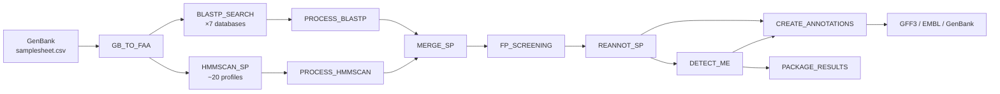

# advena

**advena** is a Nextflow pipeline for ICEscreen: detection and annotation of Integrative and Conjugative Elements (ICEs)
and Integrative and Mobilizable Elements (IMEs) in Bacillota genomes.

This pipeline is a Nextflow DSL2 reimplementation of the original [ICEscreen](https://github.com/ICEscreen/ICEscreen)
Snakemake pipeline, orchestrating the ICEscreen Python scripts and databases via Docker or Conda.

## Features

- ICE/IME structure detection and boundary assembly using the original
  [ICEscreen](https://github.com/ICEscreen/ICEscreen) logic
- Support for Docker, Singularity, Apptainer, Podman, and Conda

## Requirements

- [Nextflow](https://www.nextflow.io/) >= 23.04.0
- One of: Docker, Singularity, Apptainer, Podman, or Conda
- ICEscreen installation (set via `ICESCREEN_ROOT` or `--icescreen_root`)

## Quick Start

```bash
nextflow run exterex/advena \
    --input samplesheet.csv \
    --outdir results \
    -profile docker
```

See the [documentation](https://exterex.github.io/advena) for full details.

## Input

A CSV samplesheet with one row per genome:

| Column    | Description                  |
| --------- | ---------------------------- |
| `sample`  | Sample identifier (unique)   |
| `genbank` | Path to GenBank file (`.gb`) |

```csv
sample,genbank
genome_A,/path/to/genome_A.gb
genome_B,/path/to/genome_B.gb
```

## Parameters

| Parameter                    | Default     | Description                                   |
| ---------------------------- | ----------- | --------------------------------------------- |
| `--input`                    | (required)  | Path to samplesheet CSV                       |
| `--outdir`                   | `results`   | Output directory                              |
| `--phylum`                   | `bacillota` | Taxonomic phylum                              |
| `--codon_table`              | `11`        | Genetic code for CDS translation              |
| `--icescreen_root`           | auto-detect | Path to ICEscreen installation                |
| `--icescreen_db`             | `null`      | Override path to pre-indexed databases        |
| `--blastp_evalue`            | `0.001`     | E-value threshold for BLASTP                  |
| `--blastp_max_target_seqs`   | `10`        | Max target sequences per BLASTP query         |
| `--min_cds_between_segments` | `100`       | Min CDS count between mobile element segments |
| `--max_cds_for_ime_size`     | `10`        | Max CDS count for IME size classification     |

## Output

Results are organized per sample under `<outdir>/<sample>/`:

```text
<sample>/
├── detected_mobile_elements/
│   ├── <sample>_detected_ME.tsv
│   ├── <sample>_detected_ME.summary
│   ├── <sample>_detected_SP_withMEIds.tsv
│   └── standard_genome_annotation_formats/
│       ├── <sample>_icescreen.gff.gz
│       ├── <sample>_icescreen.embl.gz
│       ├── <sample>_icescreen.gb.gz
│       ├── <sample>_source.fa.gz
│       └── <sample>_source.gff.gz
├── detected_signature_proteins/
│   └── <sample>_detected_SP.tsv
├── param.conf.gz
└── tmp_intermediate_files.tar.gz
```

## Profiles

Combine a container engine profile with optional execution profiles:

```bash
-profile docker               # Docker
-profile singularity,hpc      # Singularity on an HPC cluster
-profile singularity,slurm    # SLURM cluster with Singularity
-profile conda                # Conda (local)
-profile test,docker          # Test dataset with Docker
```

## Pipeline Overview



## Citations

If you use this pipeline, please cite:

> Lao, J., Lacroix, T., Guedon, G., et al. ICEscreen: a tool to detect Firmicute ICEs and IMEs, isolated or integrated
> in genomes. _NAR Genomics and Bioinformatics_, 2024.

See [CITATIONS.md](CITATIONS.md) for a complete list of tools used by this pipeline.

## License

This project is licensed under the [GNU Affero General Public License v3.0](LICENSE).
