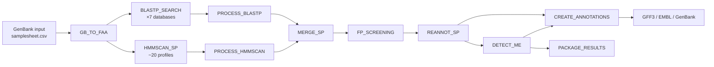

# advena

**advena** is a Nextflow pipeline for ICEscreen: detection and annotation of Integrative and
Conjugative Elements (ICEs) and Integrative and Mobilizable Elements (IMEs) in Bacillota genomes.

This pipeline is a Nextflow DSL2 reimplementation of the original
[ICEscreen](https://github.com/ICEscreen/ICEscreen) Snakemake pipeline, orchestrating the ICEscreen
Python scripts and databases via Docker or Conda.

---

## Overview



---

## Features

- ICE/IME structure detection and boundary assembly using the original [ICEscreen](https://github.com/ICEscreen/ICEscreen) logic
- Support for Docker, Singularity, Apptainer, Podman, and Conda

---

## Quick start

```bash
nextflow run exterex/advena \
    --input samplesheet.csv \
    --outdir results \
    -profile docker
```

See [Installation](installation.md) and [Usage](usage.md) for full details.
